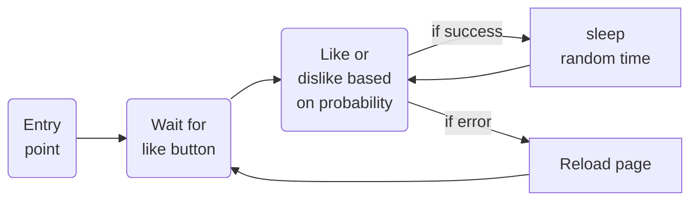

# tbot

A simple Tinder automation bot.

There are many other bots out there, but many are quite complex (automated login, stat collection, etc.). This bot aims to be as simple as possible, and by doing so, (hopefully) be robust and easy to troubleshoot.

All browser cache data are stored locally, so once you log in once, you should stay logged in. After that, the logic is simple:



Safety net:
If an error occurs twice in a row, the app will stop

## Install, running and fine-tuning

#### Install requirements using conda:
```
conda create -n tbot python=3.10
conda activate tbot
conda install -r requirements.txt 
```

#### Run:
```
python app.py
```

#### Keep undetected-chromedriver updated:

If you get the error:
```
urllib.error.HTTPError: HTTP Error 404: Not Found
``` 

it may be that your package is out of date. The chromedriver uses the browser installed on your computer. As your browser updates, you may need to update the package as well. To do this run:

```
pip install undetected-chromedriver -U
```
Based on: https://github.com/ultrafunkamsterdam/undetected-chromedriver/issues/1511


#### Fine-tuning:

If you would like to change any values, you can adjust the parameters at the beginning of the ```app.py``` file.

```python
# parameters
chance_to_like = .93
min_wait_time = .5
max_wait_time = 2
max_wait_for_like_button = 240
``````
