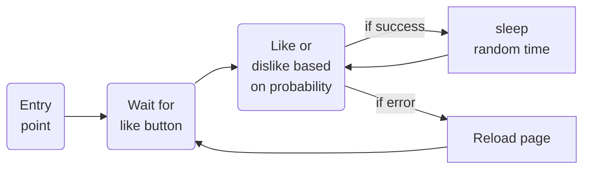

# tbot

A simple tinder automation bot.

There are many other bots out there, but many are quite complex (automated login, stat collection, etc.). This bot aims to be as simple as possible, and by doing so, (hopefully) be robust and easy to troubleshoot.

All browser cache data are stored locally, so once you login once you should stay logged in. After that the logic is simple:



Saftey net:
if an error occurs twice in a row, the app will stop

## Install and running and fine tuning

#### Install using conda:
```
conda create -n tbot python=3.10
conda install -r requirements.txt 
```

#### Run:
```
python app.py
```

#### Fine-tuning:

If you would like to change any values, you can adust the parameters at the beginning of the ```app.py``` file

```python
# parameters
chance_to_like = .93
min_wait_time = .5
max_wait_time = 2
max_wait_for_like_button = 240
``````
